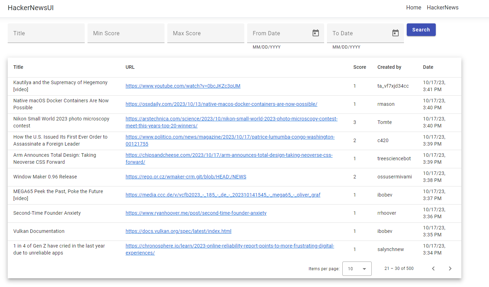

# Hacker News UI

Angular Front-End app that allows users to view the newest stories from the feed in https://github.com/HackerNews/API  
This UI calls https://github.com/adrlopez/HackerNews API

## Table of Contents
- [Hacker News UI](#hackernewsui)
  - [Table of Contents](#table-of-contents)
  - [Introduction](#introduction)
  - [Features](#features)
  - [Pre Requisites](#pre-requisites)
  - [Installation](#installation)
  - [Usage](#usage)

## Introduction

This UI consumes a C# .NET Core backend app (https://github.com/adrlopez/HackerNews). It returns the new stories from the feed and provides a search functionality.

## Features

The app has been implemented with Angular using the template from .NET. (https://learn.microsoft.com/en-us/aspnet/core/client-side/spa/angular?view=aspnetcore-7.0&tabs=visual-studio)
A new Angular component was created for displaying search fields and the table with the results. HTML table is rendered using RxJS and Angular Material.

**Technology**: Angular v15.2.8, Node v16.16.0, RxJS, Angular Material.

### Pre Requisites

Start the backend API in your local. See https://github.com/adrlopez/HackerNews

### Installation

* Install Node JS latest version and Visual Studio Code or desired IDE.
* Execute 'npm i @angular/cli' in a terminal for installing Angular.
* Clone and open the repo in Visual Studio Code
* Open up a new terminal in Visual Studio Code, and run 'ng serve'
* Open up http://localhost:4200/ in a browser

## Usage

The usage of the UI is straightforward. You can search stories by title, score, date, createdBy and page/size.

